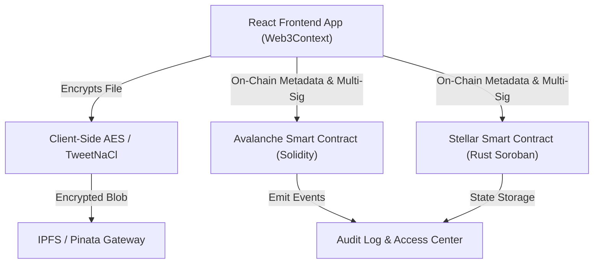

# SpooVault 🔐

[](https://opensource.org/licenses/MIT)
[]()
[](https://www.typescriptlang.org/)
[](https://cchain.explorer.avax-test.network/)
[](https://stellar.org/soroban)

Enterprise-grade document custody app supporting both **Avalanche (EVM)** and **Stellar (Soroban)** networks with client-side encryption, guardian-based approvals, automated dead-man's switch logic, and NFT access passes.

---

## 🌐 Live Demo & Smart Contracts

- **Live Application**: [https://spoovault.web.app](https://spoovault.web.app)
- **Avalanche Fuji Contract**: `0x64128680775Ef626379DeF6E5c815AeA8F4707Ef` (Chain ID `43113`)
- **Stellar Soroban Contract**: Rust Soroban contract in `contracts-stellar` (supported via Freighter Wallet & mock mode)

---

## ✨ Key Features

- **Multi-Chain Architecture**: Seamlessly toggle between Avalanche Fuji (EVM) and Stellar Soroban from the sidebar.
- **Zero-Knowledge Client-Side Encryption**: Documents are encrypted in the browser with TweetNaCl / AES-256 before leaving your device.
- **Guardian Multi-Sig Approval**: Distribute access keys across trusted guardians requiring threshold approval before document release.
- **Proof-of-Life & Dead-Man's Switch**: Configurable inactivity timers automatically release encrypted access packages to designated beneficiaries if owner heartbeat lapses.
- **IPFS Storage & Proxying**: Decoupled decentralized storage with optional serverless proxy to prevent Pinata API key exposure.
- **NFT Access Passes**: Tokenized authorization layers representing access rights to specific document vaults.

---

## 🏗 System Architecture



---

## 🚀 Quick Start

### 1. Prerequisites
- Node.js v18+ and npm
- MetaMask (for Avalanche Fuji) or Freighter Wallet (for Stellar)

### 2. Installation
```bash
git clone https://github.com/spoo-vault/spoovault.git
cd spoovault
npm install
```

### 3. Environment Configuration
Copy `.env.example` to `.env`:
```env
VITE_CONTRACT_ADDRESS=0x64128680775Ef626379DeF6E5c815AeA8F4707Ef
VITE_AVALANCHE_RPC=https://api.avax-test.network/ext/bc/C/rpc
VITE_CHAIN_ID=43113
VITE_CHAIN_NAME=Avalanche Fuji Testnet
VITE_IPFS_GATEWAY=https://gateway.pinata.cloud/ipfs/
# VITE_IPFS_PROXY_URL=http://localhost:3001
# VITE_SPOOVUALT_PROXY_SECRET=
# Optional: extra download gateways (Pinata, Infura, Cloudflare, ipfs.io are already pooled)
# VITE_IPFS_FALLBACK_GATEWAYS=
```

### 4. Run Development Server
```bash
npm run dev
```

---

## 🧪 Testing & Verification

- **Unit Tests**: `npm test`
- **Smoke Check**: `npm run test:smoke`
- **Hardhat EVM Contract Tests**: `npm run test:contracts`
- **Stellar Soroban Tests**: `npm run test:stellar`
- **TypeScript Verification**: `npx tsc --noEmit`
- **Production Bundle Check**: `npx vite build` emits named `vendor-react`, `vendor-heroui`, `vendor-ethers`, and lazy `vendor-stellar` chunks so the entry JavaScript bundle stays below the initial-load budget.

---

## 📂 Project Structure

```
spoovault/
├── contracts/             # Solidity smart contracts for EVM (Avalanche)
├── contracts-stellar/     # Rust smart contracts for Stellar Soroban
├── docs/                  # Architectural documentation & manual checklists
├── scripts/               # Deployment, proxy, and verification scripts
├── src/
│   ├── components/        # React UI components (HeroUI + Tailwind)
│   ├── context/           # Web3 & Network State Management
│   ├── pages/             # Dashboard, Vaults, Documents, Access Center, NFT Gallery
│   ├── services/          # Contract, Encryption, Telemetry services
│   └── utils/             # Crypto helpers, formatters, button styles
├── LICENSE                # MIT Open Source License
└── package.json
```

---

## 📜 License & Contribution

- **License**: [MIT License](file:///c:/Users/HP/spoovault/LICENSE)
- **Contributing Guidelines**: See [CONTRIBUTING.md](file:///c:/Users/HP/spoovault/CONTRIBUTING.md)
- **Security Policy**: See [SECURITY.md](file:///c:/Users/HP/spoovault/SECURITY.md)
